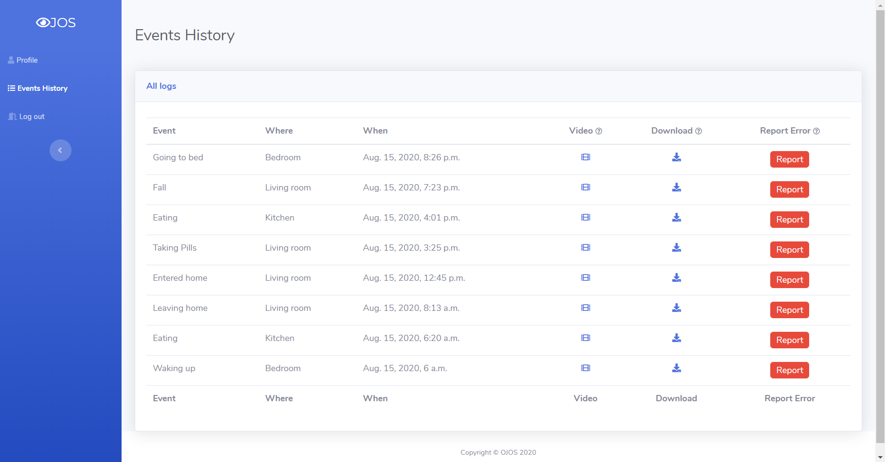

# OJOS

## Introduction
At some point in our lives, most of us will become carers to our elderly parents. Unfortunately, due to our busy lifestyles, we can not always be there to attend to them. To address this problem, many choose to install security cameras in their parents’ homes. This way they can instantly check in on their parents, even multiple times every day. Sadly, this solution is far from being perfect: There is practically zero chance to catch a critical event, such as falling or violence, at the moment it happens. In addition, in the cases of these events, response time is a critical factor, and a delayed response might cost lives.

Fortunately, today’s technology allows us to create a solution. **OJOS (“eyes” in Spanish) is a system that connects to cameras at parents’ homes, and provides carers with real-time alerts about dangerous events using computer vision.** This solution provides 24/7 guard, significantly shortens the reaction time to dangerous events, and can potentially save lives. Moreover, by analyzing video over longer periods of time, OJOS can spot deteriorations in the elderly’s behavior. Today, this information is unobtainable without constant human observation.

OJOS is a submission to the `Web and Mobile Applications powered by PyTorch` category of the hackathon.

[Watch the project video submission](https://www.youtube.com/watch?v=1D2jJzY3rBE)

## Screenshots
**The user profile page**  
Here, the user can edit their data, and their cameras:

**The events page**  
Here, the user can view all the events the system recognized

**Reporting events**  
In case of wrong classification, the user can report an event. This way, we can retrain the models and achieve better accuracy as we progress.

## Tech Stack
Our project relies on multiple open source software and external services.

* Web: Django, PostgreSQL
* ML and Image processing: Pytorch, ML_Flow, albumentations, OpenCV, face_recognition lib, sklearn, numpy, pandas, matplotlib
* Tools: youtube-dl, FFMPEG
* External: Mailgun, Twilio (Future integration), Android Virtual Device, AWS

Connecting to the IP cameras turned out to be a big challenge. After trying many different options, we solved it by running Android emulators on EC2 machines, capturing the video from the screen, and streaming it to the classification system.

We used [neu.ro](https://neu.ro/) to train our human position models:
- First we trained on UCF101, a public dataset for human action
- We then applied transfer learning on fall & positions datasets: [Fall Detection Dataset](http://www.falldataset.com/), [UR Fall Detection Dataset](http://fenix.univ.rzeszow.pl/~mkepski/ds/uf.html), [Multiple cameras fall dataset](http://www.iro.umontreal.ca/~labimage/Dataset/), [Fall detection Dataset (#2)](http://le2i.cnrs.fr/Fall-detection-Dataset?lang=en).

## Code
All the code can be found under the organization [@myojos](https://github.com/myojos) in GitHub.
A more technical analysis can be found [here]().

Repository | Description
--- | ---
[ojos-user-website](https://github.com/myojos/ojos-user-website) | The user facing web app.
[ojos-notifications-system](https://github.com/myojos/ojos-notifications-system) | Code responsible for sending immediate alerts and daily reports (containing all the events that happened throughout the day). 
[aws_config](https://github.com/myojos/aws_config) | Configuration and shell commands for the AWS instance
[StickFigureMode](https://github.com/myojos/StickFigureMode) | Repository for the code that helps us preserve privacy by replacing humans with stick figures
[fall-detection](https://github.com/myojos/fall-detection) | Repository with the main content: models, notebooks, etc.

## URL
The system is up and running on [myojos.tech](https://www.myojos.tech)

## Team
We started working on this project one month before the hackathon. The core PyTorch based part happened during the hackathon period.

Name | Email
--- | ---
Jonathan Harel | harelj6@gmail.com
Khaled Fadel | khaledkee0@gmail.com