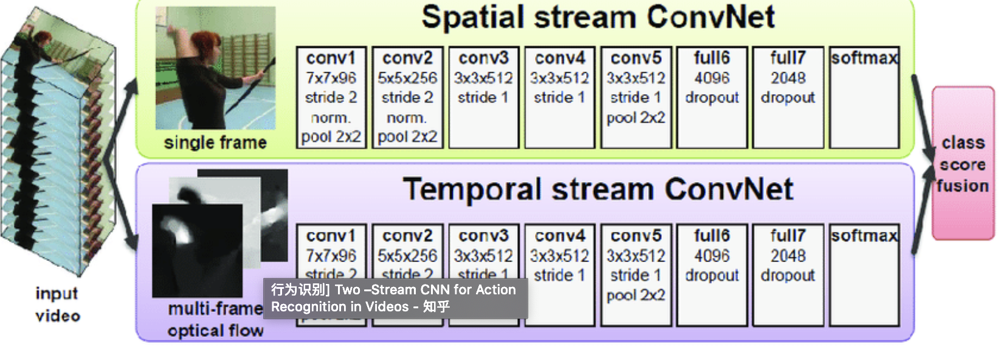
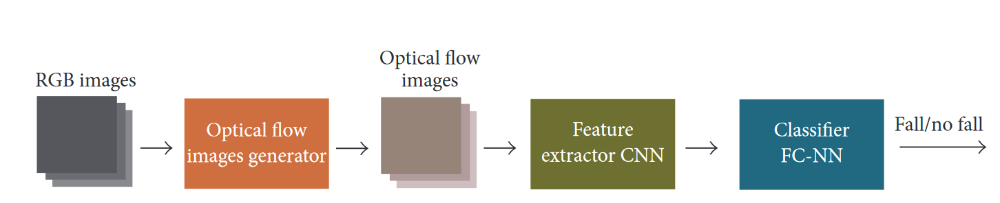

# OJOS

## Introduction
OJOS relies on two parts to guard our elderly parents. The reports system and the alerts system:
 1. The alerts system is done by sending the user SMS alerts to warn in case of fall, violence or specific incident that requires timely intervention.
 2. The reports system is done by showing the user the events of interest on the events page and generate summary report regularly to the user about the daily activities of the elderly and highlight any potential anomaly.
 
The [monitoring system](https://github.com/myojos/Monitoring-System) captures the videos from the AVD which contains the android client of the camera manufacture and process the video throught different models including:
1. [Fall Detection](https://github.com/myojos/fall-detection): which takes 10 consecutive frames and report whether there is fall happening.
2. [People counter](https://www.pyimagesearch.com/2018/08/13/opencv-people-counter/): a library to count people inside the camera view, the user can set constraints on the number of people in house and will be notified if the number lies outside of these frames.
3. [Face recognition](https://github.com/ageitgey/face_recognition): a library to encode and compare facial features. It allows the user to be notified of unrecognized faces and track the movement of a person of interest.

## Fall Detection
The fall detection model is based in part on the paper [Vision-Based Fall Detection with CNNs](https://doi.org/10.1155/2017/9474806) that uses two streams models, one operates on 3-channel images and another operates on Optical Flows to understand the movements and not just static context. We use MobilNetV2 in PyTorch library instead of VGG to improve the performance of the model as we plan to deploy the model to edge devices.

We tried multiple Optical Flow algorithms from OpenCV library and they provided different speeds and different accuracy scores:

| Algorithm | FPS | Train accuracy |
| --- | --- | --- |
| Farneback | 20 | 81% |
| SimpleFlow | 3 |  |
| PCA | 15 | 84% |
| DeepFlow | 4 | 85% |
| SparseToDense | 25 | 67% |

The accuracy was calculated on [fall dataset](http://www.falldataset.com/) on the Optical Flow stream only.

We trained the two streams model on both [UCF dataset](https://pytorch.org/docs/stable/_modules/torchvision/datasets/ucf101.html) and [fall dataset](http://www.falldataset.com/). UCF dataset is provided by PyTorch. The model scored 60% on UCF (binary classification for fall and not fall). And 74% for fall dataset (6-classes classification).

## Challenges we ran into
There are many challenges related to training the fall detection models including:
1. Small size of datasets: even in large datasets like UCF, the fall class is a small part of the dataset. We overcome that by training on multiple datasets. Between different datasets, we leave the feature extractor part as it's and only replace the linear classification part with new random one compatible with the output in the dataset.
2. View-point dependency: we used many augmentations to help mitigate the dependency on the view-point of the camera. We also plan to work with [multi-cam dataset](http://www.iro.umontreal.ca/~labimage/Dataset/) to improve the model.

We also faced challenges with the monitoring system, such as:
1. Not many consumer cameras support standard streaming protocols like [port-forwarding](https://en.wikipedia.org/wiki/Port_forwarding) or [ONVIF](https://en.wikipedia.org/wiki/ONVIF). They also don't provide API-friendly interface. For these cameras, we open Android Virtual Device, and go to the client app and record the screen of the device. This is quite resource heavy and may break if the interface of the App changed. But fortunately the app remain working and connect to the camera even when there are many newer versions.
2. Even if RTSP is enabled, we need to do [port-forwarding](https://en.wikipedia.org/wiki/Port_forwarding) from the client side to be able to connect remotely to the camera. Fortunately, most routers support standard protocols like [UPnP](https://en.wikipedia.org/wiki/Universal_Plug_and_Play) and [IGD](https://en.wikipedia.org/wiki/Internet_Gateway_Device_Protocol).

## What's next for OJOS
There are many parts that remain to be done. On the ML side:
1. we need to include Pose-Estimation to help in fall-detection and in the StickFigureMode.
2. we need data to be able to track elderly activities like eating, sleeping, taking pills, etc and create reports to the caregivers about it.
3. We need to integrate with alerts system like [Twilio](https://www.twilio.com/) and create an Android App to give push-notifications on phones.